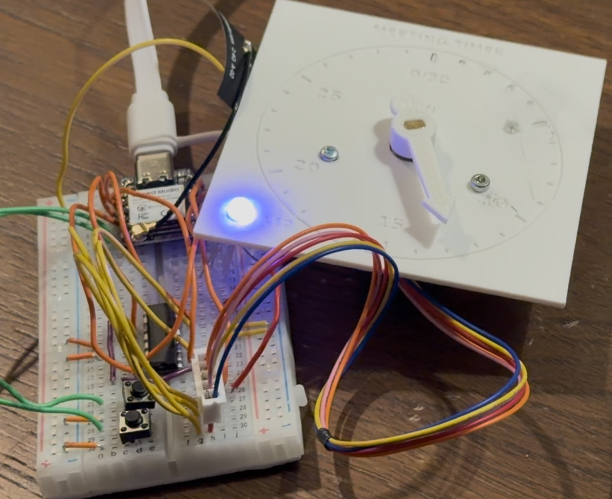
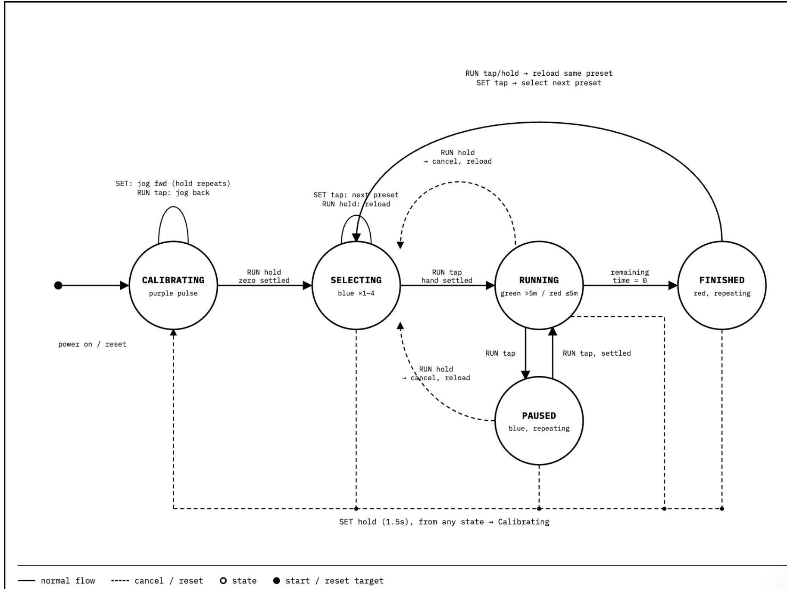

# Meeting Timer — Project Summary

**Course:** ECE 463

## 1. Device Description

The Meeting Timer is a countdown clock built around a Seeed
XIAO ESP32-S3 microcontroller. A 28BYJ-48 stepper motor, driven through
an L293D H-bridge driver, rotates a physical clock hand around a printed
dial face labeled with 5-minute increments from 0 to 30 (with 0 and 30
sharing a single mark). An onboard RGB LED communicates the device's
current state (calibrating, selecting a duration, running, paused, or
finished), and two pushbuttons — **SET** and **RUN** — are used to zero
the hand, pick a preset duration, and start/pause/reset the countdown.

Four presets are supported: **15, 20, 25, and 30 minutes** (no 10-minute
preset in the current firmware).

### Core hardware
| Component | Role |
|---|---|
| XIAO ESP32-S3 (U1) | Main controller |
| L293D H-bridge driver (U2) | Drives the 28BYJ-48 stepper motor |
| 28BYJ-48 stepper motor (M1) | Rotates the clock hand |
| RGB LED (D1) with 220 Ω resistors | Status indication |
| SET button (SW1), RUN button (SW2) | User input |

## 2. Photos

*The assembled breadboard circuit — XIAO ESP32-S3, breadboard wiring, an
RGB LED lit blue, and the 3D-printed dial/hand assembly with the stepper
motor connected via a 5-wire cable.*

## 3. How to Use

**Button positions** (as originally laid out, XIAO on the left): SET is
the button closer to the XIAO; RUN is farther away. A **tap** is a
quick press-and-release; a **hold** is about 1.5 seconds.

### Step 1 — Power on and zero the hand
1. Connect USB with both buttons released. (If needed, start the
   program in Thonny with F5.)
2. While the LED pulses **purple**, tap **SET** to move the hand
   forward (hold to keep moving), or tap **RUN** to move it backward.
3. Align the hand with the 0/30 mark, release the buttons, and wait
   for it to stop. Hold **RUN** for 1.5 seconds, then release to
   confirm zero and enter selection mode.

### Step 2 — Select a duration and start
After a fresh power-up and zero calibration, 15 minutes is selected by
default.

| Duration | Extra SET taps | Blue pulses/group | Start |
|---|---|---|---|
| 15 min | 0 | 1 | Tap RUN once |
| 20 min | 1 | 2 | Tap RUN once |
| 25 min | 2 | 3 | Tap RUN once |
| 30 min | 3 | 4 | Tap RUN once |

Wait for the hand to stop moving before tapping RUN. SET cycles
15 → 20 → 25 → 30 → 15. Count the blue LED pulses (in groups with a
2-second gap) to confirm the current selection. SET only changes the
selection before starting or after the timer has finished.

### Step 3 — Read the LED
| LED behavior | Meaning |
|---|---|
| Purple pulses | Setting the hand's zero position |
| 1–4 blue pulses + gap | Selecting 15/20/25/30 minutes |
| Green pulses | Running, more than 5 minutes remain |
| Red pulses (counting down) | Running, 5 minutes or less remain |
| Repeating blue, no gap | Paused |
| Red pulses, hand at zero | Finished (continues until acknowledged) |

There is no buzzer — the timer is read visually.

### Step 4 — Pause, restart, or reset
- **Pause/resume:** tap RUN to pause; tap RUN again (once settled) to resume.
- **Cancel/reload:** hold RUN for 1.5 seconds, wait for the hand to
  reposition, then tap RUN to restart.
- **After completion:** tap RUN to reload, wait, then tap RUN again to
  start — or tap SET to pick the next preset.
- **Recalibrate:** outside purple mode, hold SET for 1.5 seconds to
  repeat zero-setting (the selected preset is retained).
- **Turn off:** unplug USB. Every power-up requires a fresh zero
  calibration; an interrupted countdown is not saved.

## 4. Video of Device in Operation

 [Meeting Timer in operation](https://drive.google.com/file/d/1wPqdghsCuRPDjGa9a-UBrjxjEYcKuRwZ/view?usp=share_link)

## 5. References to Source Materials

- XIAO ESP32-S3 hardware documentation (Seeed Studio)
- L293D quadruple half-H driver datasheet (Texas Instruments)
- 28BYJ-48 stepper motor datasheet/reference
- CircuitPython/Thonny toolchain used for firmware development
- `code/meeting_timer.py` — project firmware (`QUICK_TEST = False` for
  normal operation; accelerated test mode uses shorter durations)

## 6. Project Support Documents

### Schematic
See attached schematic: **`schematic.pdf`** (KiCad, "Miniproject schematic",
Rev. —, Sheet 1/1).

Summary of connections:
- **XIAO ESP32-S3 (U1):** GPIO7/8/9 drive the RGB LED channels (each
  through a 220 Ω resistor); additional GPIOs connect to SET (SW1) and
  RUN (SW2) buttons and to the L293D driver inputs.
- **L293D Driver (U2):** Receives logic-level control signals from the
  XIAO and drives the 28BYJ-48 stepper motor (M1) through connector J1.
- **RGB LED (D1):** Common status indicator, driven from three GPIOs
  through current-limiting resistors.
- **Power/Ground:** Shared 5V/3V3/GND rails across the XIAO, LED, and
  motor driver.

### Firmware State Machine

The firmware moves through five states:

| State | LED indication | Description |
|---|---|---|
| **Calibrating** | Purple pulse | Entered on power-on/reset. SET jogs the hand forward (hold repeats); RUN tap jogs it back. Holding RUN for 1.5 s once the hand is zeroed and settled advances to Selecting. |
| **Selecting** | Blue ×1–4 | SET tap cycles through the four presets (15→20→25→30→15). RUN tap, once the hand has settled, starts the countdown (→ Running). |
| **Running** | Green (>5 min left) / Red (≤5 min left) | Counts down. RUN tap pauses (→ Paused). Reaching zero remaining time moves to Finished. |
| **Paused** | Blue, repeating | RUN tap resumes Running once settled. |
| **Finished** | Red, repeating | Terminal state until acknowledged. |

**Global reset:** holding **SET for 1.5 seconds from any state** cancels
and returns to Calibrating.

**Cancel/reload:** holding **RUN for 1.5 seconds** from Selecting, Running,
or Paused cancels the current countdown and reloads the same preset back
into Selecting. From Finished, a RUN tap or hold reloads the same preset;
a SET tap instead selects the next preset.

