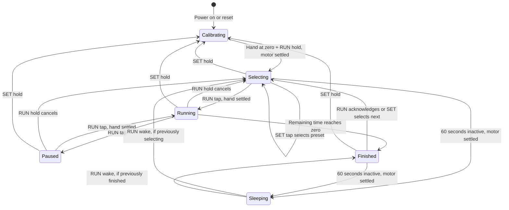

# Meeting timer firmware

Status: MicroPython implementation with desktop regression tests. **TODO: verify
the assembled wiring and run on the real XIAO/motor.** No hardware test, timing
accuracy measurement, or power measurement has been completed by this code change.
The existing empty README files and course template are preserved.

## What the course requires

The supplied *Mini-Project Instructions - Google Docs.pdf*, pages 1 and 4–6,
requires a self-contained timer using MicroPython (not Arduino):

| Requirement | Implementation |
| --- | --- |
| 15, 20, 25, 30 minute presets | `config.PRESET_MINUTES`, selected with SET |
| Mechanical hand shows time remaining | Fixed 30-minute dial; target computed from remaining time |
| Two switches control operation | Debounced SET/RUN, short and long actions below |
| Three output colours and PWM pulsing | RGB channels; 1 kHz PWM with a one-second brightness pulse |
| 5-wire unipolar stepper through L293D; wave stepping | One selected phase per step, four GPIO inputs plus driver enable |
| Demonstrate low-power operation (page 1 outcome) | Radios disabled, coils released, idle light sleep |
| Document operation with chart and commented code | State chart below; module/class/function docstrings and rationale comments |

The handout does **not** prescribe the button gestures, colour meanings, pause
behaviour, or a numerical timer-accuracy tolerance. Those below are team design
choices, not additional course requirements. Hardware schematics, CAD, finished
photos, and the separate Drive `/video` demo link remain project deliverables.

## Check the circuit before running

MicroPython `Pin(1)` means **ESP32 GPIO1**, which is XIAO **D0**. It does not
mean a package pin number. GPIO0 is the board's BOOT signal. The course table's
GPIO0–GPIO3 motor labels must not be copied blindly into MicroPython.

This implementation expects the following concrete wiring:

| Function | XIAO label | ESP32 GPIO | Connection |
| --- | --- | ---: | --- |
| Motor input 1 | D0 | 1 | L293D pin 2 (1A); output pin 3 to orange |
| Motor input 2 | D1 | 2 | L293D pin 7 (2A); output pin 6 to pink |
| Motor input 3 | D2 | 3 | L293D pin 10 (3A); output pin 11 to yellow |
| Motor input 4 | D3 | 4 | L293D pin 15 (4A); output pin 14 to blue |
| Driver enable | D7 | 44 | BOTH L293D pins 1 and 9; remove the supply jumper |
| SET | D4 | 5 | One switch pin here, the other to GND |
| RUN | D5 | 6 | One switch pin here, the other to GND |
| LED red | D8 | 7 | Red channel through its own 220-ohm resistor |
| LED green | D10 | 9 | Green channel through its own 220-ohm resistor |
| LED blue | D9 | 8 | Blue channel through its own 220-ohm resistor |

- L293D **pin 16 (VCC1) and pin 8 (VCC2) go to 5V**, not 3V3. TI specifies
  a minimum 4.5 V logic supply. The XIAO's 3.3 V control signals satisfy the
  driver's 2.3 V minimum input-high requirement; do not apply 5 V to a GPIO.
- Motor red common stays at **+5V**. L293D outputs follow their inputs, so the
  selected input must be **LOW** to sink coil current; the other three are HIGH.
  The handout's one-HIGH/three-LOW pattern would select the wrong coil polarity
  with this common connection. Do not substitute a ULN2003 sequence unchanged.
- This code uses a cyclic orange → yellow → pink → blue phase order. Verify
  smooth rotation on the actual motor; the handout's wire order is not a
  substitute for confirming your motor variant. Adjust `MOTOR_PHASE_ORDER`
  only after tracing the coil wires. Set `MOTOR_DIRECTION=-1` if positive jogs
  go counterclockwise when viewed from the clock face.
- L293D pins 4, 5, 12, 13 and all circuit grounds connect to XIAO GND. The motor
  draws from the 5 V rail, not the XIAO 3V3 regulator. Follow TI's local supply
  bypassing guidance; check power capacity and voltage drop under motor load.
- The new enable connection allows true high-impedance coil release. **Remove
  the existing enable-to-supply connections before connecting D7.** A 10 kΩ
  pull-down from the joined enables to GND is recommended to hold them off
  while the microcontroller resets; this is an additional component if absent
  from the kit. Keep motor power disconnected while changing wiring/flashing.
- For the RGB LED, common cathode goes to **GND**; common anode goes to **3V3**.
  Set `RGB_COMMON_ANODE=False` or `True` respectively. Identify the common lead
  and each colour using its datasheet or a diode test; do not infer the pinout
  just from a four-lead package. Each colour needs its own resistor.

**TODO:** verify these connections against the real circuit/photos. The default
`WIRING_CONFIRMED=False` and `RGB_COMMON_ANODE=None` deliberately prevent GPIO
initialisation until the configuration has been checked. These are commissioning
settings, not missing timer logic. Do not enable them merely to silence an error.

## Upload using Thonny

1. Keep the already-flashed MicroPython firmware. Choose the ESP32 interpreter
   and the XIAO's USB port in Thonny.
2. Check the circuit above. Set the two commissioning values in `code/config.py`.
   Keep the required preset values unchanged. Initially set
   `LIGHT_SLEEP_ENABLED=False` if you want continuous USB/Thonny access.
3. Copy **all four files** from `code/` to the **root of the MicroPython device**:
   `config.py`, `logic.py`, `hardware.py`, and `main.py`. Running only the local
   main.py without copying its dependencies will not work.
4. Reset/restart the device. The REPL prints the calibration controls. Stop in
   Thonny (Ctrl-C) to return to the REPL; the cleanup disables the driver/PWM.
5. Calibrate and test as below. Once commissioned, `main.py` starts automatically
   on power-up; the laptop/Thonny is not needed to operate the timer.

No Arduino libraries, pip packages, Wi-Fi credentials, or network services are
required on the device. Desktop tests use Python's standard `unittest` library.

## Controls and hand calibration

There is no home switch or encoder. On **every power-up/reset**, the timer
starts in calibration mode (purple pulsing). It briefly aligns one rotor phase
before the hand zero is accepted; it cannot infer a previous hand position.

1. Tap SET to jog clockwise about 1.4°; holding SET repeats the jog.
2. Tap RUN to jog back. Alternatively, during initial assembly fit the removable
   hand pointing at 0/30 after the alignment movement; do not force the gearbox.
3. With the hand pointing at **0/30**, hold RUN for **1.5 seconds**. Wait for
   motion to stop before confirming zero. The timer then positions the hand at
   the selected preset; wait for positioning before starting a meeting.

| State | SET tap | RUN tap | SET hold 1.5 s | RUN hold 1.5 s |
| --- | --- | --- | --- | --- |
| Calibration | Jog clockwise; hold repeats | Jog counterclockwise | Continue jogging | Accept zero once settled |
| Select preset | Cycle 15 → 20 → 25 → 30 → 15 | Start after hand settles | Recalibrate | Reset selected preset |
| Running | Ignored | Pause | Cancel and recalibrate | Cancel and reset selected preset |
| Paused | Ignored | Resume after hand settles | Cancel and recalibrate | Cancel and reset selected preset |
| Finished | Select next preset | Acknowledge and rearm | Recalibrate | Rearm selected preset |

Short actions happen on release. Holding both buttons together is ignored until
both are released. A long press never also becomes a short press. RUN pressed
before positioning finishes does not queue a start; wait and press again.

The printed face uses a **fixed 30-minute revolution**: 15 minutes is at the
bottom, 20 at the lower left, 25 at the upper left, and 0/30 at the top. The
hand counts counterclockwise toward zero. Selecting a preset uses the shorter
route around the dial. Thirty minutes and zero share an angle, but have
different timer states and LED indications.

| Indication | Meaning |
| --- | --- |
| Purple pulsing | Zero calibration required |
| 1/2/3/4 blue pulses, then a two-second gap | Selected 15/20/25/30 minutes |
| Green pulsing | Running with more than five minutes left |
| Red pulsing | Running with five minutes or less; also finished at zero |
| Continuous blue pulsing | Paused |
| LEDs off after inactivity | Idle light sleep; press RUN to wake |

After 60 seconds inactive in selection or finished state, light sleep disables
LED output and releases the motor. **RUN wakes the timer; release it, then press
again for an action.** The selected duration and calibrated position are retained
in RAM during light sleep. Running, paused and calibration modes do not sleep.
Wi-Fi and Bluetooth are disabled. Actual power reduction must be measured; the
board, LED, driver and power supply still consume some power.



## Implementation and tests

- `code/config.py`: pin mapping, calibration constants, configuration validation.
- `code/logic.py`: debouncing, countdown states, fixed-dial conversion, LED policy.
- `code/hardware.py`: nonblocking wave-step driver and PWM polarity handling.
- `code/main.py`: cooperative controller, initialization, low-power mode, cleanup.
- `tests/test_firmware.py`: deterministic desktop tests using fake pins/PWM and
  an intentionally wrapping clock.

The countdown uses elapsed `ticks_ms()` time via `ticks_diff()` rather than
counting loop iterations or stepper pulses. Motor positioning and button handling
remain responsive during motion. Late polls update remaining time immediately;
motor catch-up is rate-limited. The hand can lag if the loop stalls, and without
an encoder the firmware cannot detect a missed step or a slipping hand.

Run on your laptop from the repository root:

```sh
python3 -m unittest discover -s tests -v
```

Tests exercise full 15/20/25/30-minute durations with simulated time, pause/resume,
debouncing, long presses, two-button conflicts, clock wrapping, motor phase
polarity, final coil release, LED duty inversion, wake handling and configuration
guards. These are software tests; simulated minutes are not real timing trials.

Validation performed on 2026-09-10: **31 desktop tests passed**; all four device
modules compiled with MicroPython `mpy-cross` v1.29.0; Ruff syntax, unused-name
and import-order checks passed. Cross-compilation checks language compatibility,
not the board's pin wiring, peripheral availability or physical behaviour.

**TODO — bench acceptance:**

- Confirm LED polarity/colour mapping and a one-second brightness pulse.
- Check positive/negative motor jogs, enable-off behaviour and no missed steps.
- Measure a complete output revolution. The nominal **2048 wave/full steps**
  differs from a 4096 half-step setting; gearbox variants may need calibration.
- Verify every preset on the printed face, including 0/30 ambiguity, pause,
  resume, cancel, expiry, both-button presses, and a reset mid-meeting.
- Compare real elapsed durations with a reference clock; record error instead
  of claiming an accuracy tolerance not specified in the handout.
- Measure current in running/idle/light-sleep modes. Check RUN wake, USB recovery,
  mechanical holding with coils released, switch travel, and hand retention.

## References

- Supplied course handout, *Mini-Project Instructions - Google Docs.pdf*, pages
  1, 3–7, and *02. Miniproject.pdf*, slides 7 and 10: assignment requirements.
- [Seeed XIAO ESP32-S3 pin map](https://wiki.seeedstudio.com/xiao_esp32s3_getting_started/).
- [TI L293/L293D datasheet](https://www.ti.com/lit/ds/symlink/l293.pdf), sections
  5, 6.3 and 8: pin functions, supply/input limits, noninverting/enable behaviour.
- [28BYJ-48 motor drawing distributed by SparkFun](https://cdn.sparkfun.com/assets/8/e/0/8/e/step-motor-5v-28byj48-datasheet.pdf): nominal motor reference, not identification of the team's exact unit.
- [Adafruit support on 28BYJ-48 coil pairs](https://forums.adafruit.com/viewtopic.php?t=51868): orange/pink and blue/yellow are opposite coil pairs; variant verification remains necessary.
- [MicroPython time](https://docs.micropython.org/en/latest/library/time.html),
  [PWM](https://docs.micropython.org/en/latest/library/machine.PWM.html),
  [machine power functions](https://docs.micropython.org/en/latest/library/machine.html),
  and [ESP32 wake configuration](https://docs.micropython.org/en/latest/library/esp32.html): API behaviour. Check compatibility with the firmware flashed on your board.

Implementation was prepared with AI assistance and reviewed through the listed
automated checks. The team must perform and record the physical verification.
