# Timer state chart

This chart describes the active configuration in
[code/meeting_timer.py](../code/meeting_timer.py): real-minute timing,
fixed HIGH motor-driver enables, and light sleep disabled.

```mermaid
stateDiagram-v2
    [*] --> Calibrating: Power on or board reset
    Calibrating --> Calibrating: SET jogs forward; RUN tap jogs back
    Calibrating --> Selecting: RUN hold 1.5 s; hand at zero and settled
    Selecting --> Selecting: SET tap cycles preset; RUN hold reloads preset
    Selecting --> Running: RUN tap; hand settled
    Running --> Paused: RUN tap
    Paused --> Running: RUN tap; hand settled
    Running --> Finished: Remaining time reaches zero
    Running --> Selecting: RUN hold cancels and reloads preset
    Paused --> Selecting: RUN hold cancels and reloads preset
    Finished --> Selecting: RUN tap or hold reloads same preset
    Finished --> Selecting: SET tap selects next preset
    Selecting --> Calibrating: SET hold
    Running --> Calibrating: SET hold cancels and recalibrates
    Paused --> Calibrating: SET hold cancels and recalibrates
    Finished --> Calibrating: SET hold

    note right of Calibrating
        Purple pulse; no countdown.
        SET hold repeats forward jogs.
    end note
    note right of Running
        Green above five minutes remaining.
        Red at five minutes or less.
    end note
```

| State | Countdown and hand | LED |
| --- | --- | --- |
| Calibrating | User jogs the hand and confirms zero | Purple pulse |
| Selecting | Selected duration is loaded; hand positions to it | 1/2/3/4 blue pulses for 15/20/25/30 minutes |
| Running | Elapsed time reduces the remaining duration; hand follows | Green, then red in the last five minutes |
| Paused | Remaining time is held; any queued positioning can finish | Repeating blue pulse |
| Finished | Remaining time is zero; hand finishes positioning to zero | Repeating red pulse |

Transition rules:

- A tap is processed on release. A hold lasts about 1.5 seconds and produces
  only one long-press action. Calibration SET jogging is the exception: it
  follows the pressed level and repeats while held.
- Starting, resuming, and confirming zero require a settled hand. If a press
  is ignored during movement, release the button, wait, and press again.
- SET taps are ignored in Running and Paused. A two-button chord suppresses
  button events until both switches are released; time still advances while
  Running. In Calibrating, the chord also stops queued jogging.
- A board reset from any state returns to Calibrating, losing the unfinished
  countdown and the previous zero. Disconnecting power stops operation.
- The current program never enters a sleeping state. It disables the radios,
  but fixed enables remain HIGH and idle light sleep is disabled. Power-saving
  behavior still needs demonstration; the chart does not claim coil-off sleep.
- Quick test mode uses the same states and controls, with 30/40/50/60-second
  durations and a 10-second red-warning threshold.

These gestures and colour meanings are team design choices. The course asks
for two-button controls, three PWM colours, and a chart explaining operation;
see [references](references.md). The practical steps are in the
[operating instructions](operating-instructions.md).
